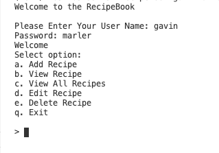

# RecipeBook
## Overview
This program uses Python and NoSQL to insert and access a cloud database holding information about recipes. You have the option to add recipes, view a single recipe, view all recipes, edit a recipe, and delete recipes. All information is saved in the cloud firestore database for easy access.
## Development Environment
* VS Code
* Python 3.8.5
* Firestore
* NoSQL

## Execution
To run put: 
```python
python main.py
``` 
The ouput is like this:   


You can then follow the steps to update your database.

## Useful Websites

* [Here](https://docs.python.org/3.8/) is the Python reference.
* [Here](https://www.geeksforgeeks.org/introduction-to-nosql/) is a basic NoSQL starter guide.
* [Here](https://stackoverflow.com) is Stack Overflow.
